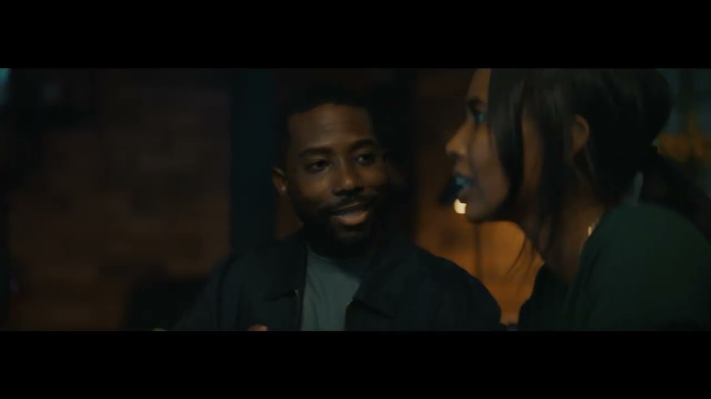

# Natural Language Processing - Challenge 2

## Trailer

---

## Goal

The only clues Michaela & Damone have on Eva’s whereabouts are a few key words. They've scoured the internet for relevant articles, but there’s just too much information to process quickly.

Use your NLP skills to build a topic model that will answer the mystery of who or what La Eterna is.
